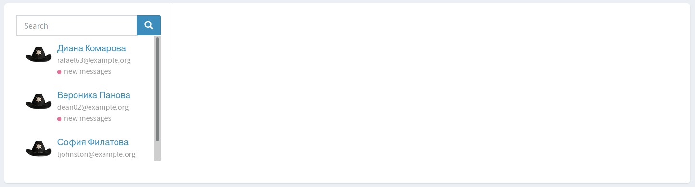
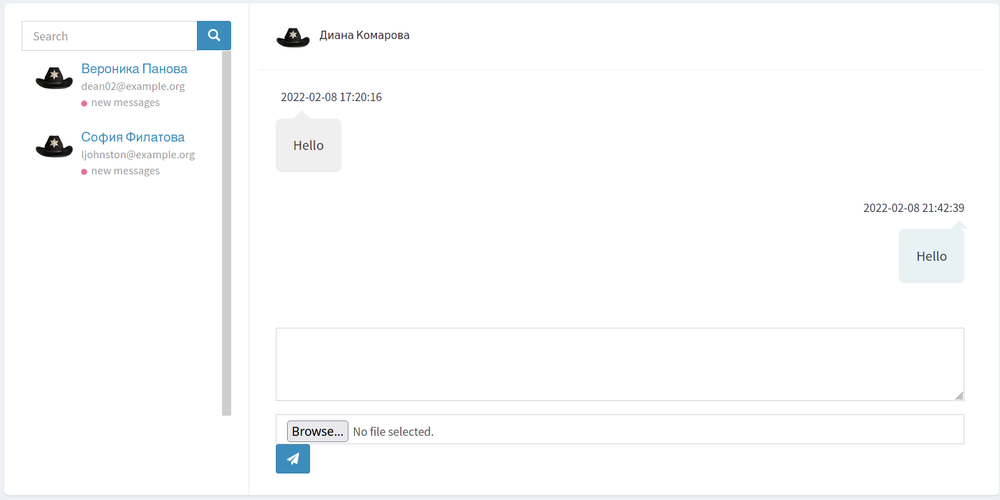

laravel-admin extension
======

## Installation

Add git repository to composer.json file
```
"repositories": [
    ...
    {
        "url": "https://github.com/jumas-cola/adminchat",
        "type": "git"
    },
    ...
],
```

Install extension via composer
```
composer require laravel-admin-ext/adminchat
```

Apply migrations and publish assets
```bash
php artisan migrate --path=app/Admin/Extensions/laravel-admin-ext/adminchat/database/migrations/2022_02_07_115826_create_admin_chat_messages_table.php
php artisan vendor:publish --tag=adminchat
```

Add your auth middleware to admin.php config file
```
'extensions' => [
    ...
    'adminchat' => [
        'auth_middleware' => 'auth:sanctum',
    ]
    ...
],
```

## Routes

### API for user side
```
GET /adminchat/messages  
```
Return: application/json  
Paginated messages of chat
```
POST /adminchat/messages  
```
```
{
  "text": "Hello, Admin!",
  "file": [Binary file]
}
```
Content-Type: multipart/form-data  
Return: application/json  
Paginated messages of chat

### Pages in admin panel
```
GET /admin/adminchat
```


Page with chats where has new messages
```
GET /admin/adminchat/1
```
Page of specific chat

